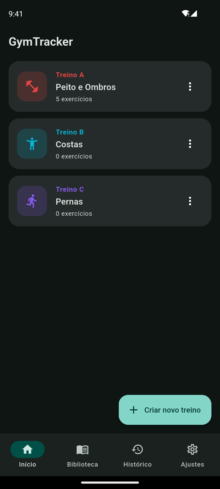
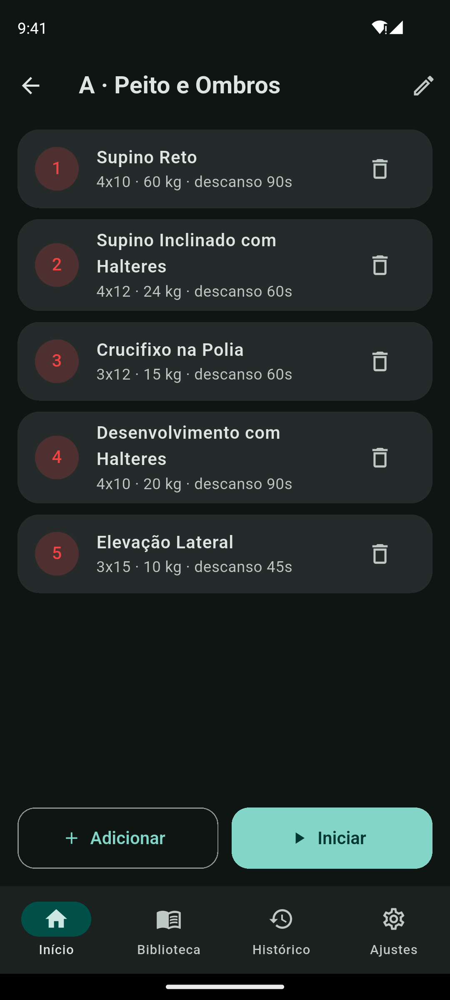
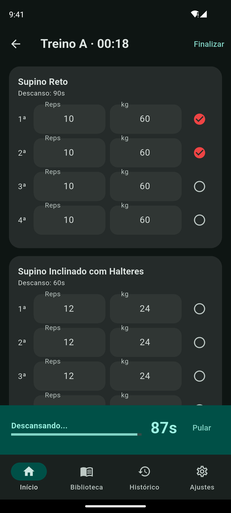
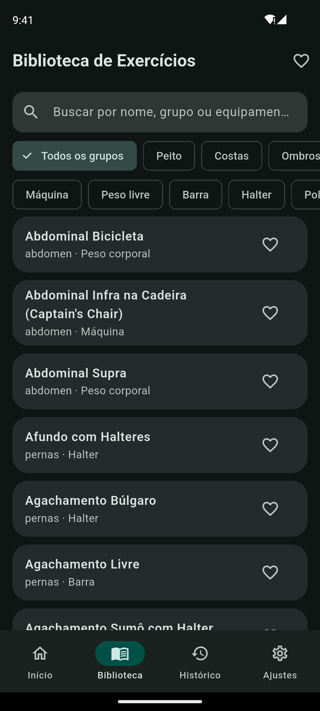

# GymTracker

Aplicativo mobile para montar e acompanhar treinos de academia. Você cria suas fichas (Treino A, B, C…), registra as séries durante o treino e acompanha a evolução no histórico. Tudo fica salvo no celular, sem precisar de conta ou internet.

<p align="center">
  
  
  
  
</p>

## Funcionalidades

- **Fichas de treino**: crie treinos com letra, nome, cor e ícone, e defina séries, repetições, carga e descanso de cada exercício.
- **Modo treino**: marque as séries concluídas, ajuste reps e carga na hora e use o cronômetro de descanso automático, que avisa com notificação quando o tempo acaba.
- **Biblioteca de exercícios**: mais de 70 exercícios com busca, filtros por grupo muscular e equipamento, favoritos e instruções de execução.
- **Histórico**: sessões registradas com volume total, duração e séries feitas.
- **Ajustes**: tema claro ou escuro e unidade de carga (kg ou lb).

## Tecnologias

- [Flutter](https://flutter.dev) / Dart
- [Riverpod](https://riverpod.dev) para gerenciamento de estado
- [Drift](https://drift.simonbinder.eu) (SQLite) para o banco de dados local
- [go_router](https://pub.dev/packages/go_router) para navegação
- `flutter_local_notifications`, `shared_preferences` e `youtube_player_iframe`

## Como rodar

```bash
flutter pub get
flutter run
```
